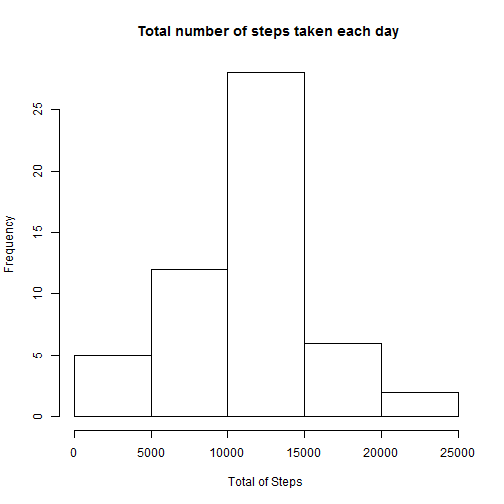
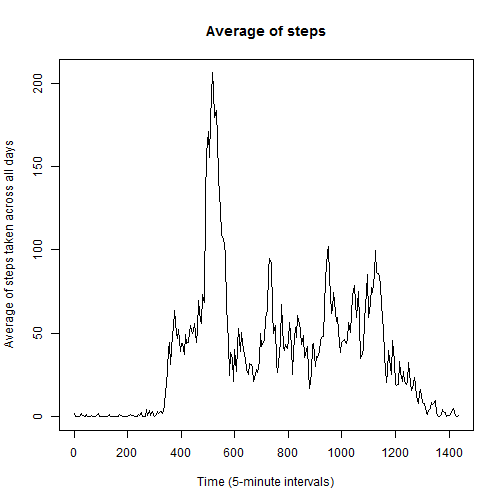
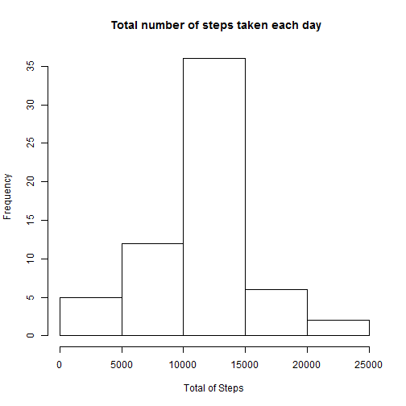
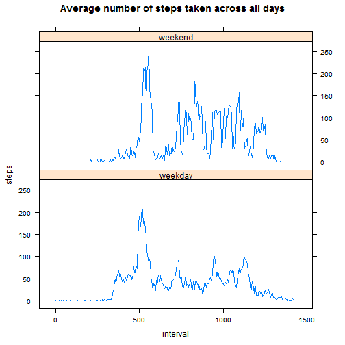

## Load the data


```r
data <- read.csv(file="F:/data science specialist/course5/project1/activity.csv",head=TRUE,sep=",")
```
## Processing the data
in this data we represent the hour with 60 minute

```r
size <- nrow(data)
data_temp=data
newIntervals <- seq(0,1435,5)
newIntervalsSize <- length(newIntervals)
j <- 1

for(i in 1:size)
{
  if (j > newIntervalsSize) # reset the iterator
    j <- 1        
  
  data_temp$interval[i] = newIntervals[j]
  j <- j + 1
}
```
## what is mean total number of steps taken per day
1-Histogram of the total number of steps taken each day

```r
agg_Data <- aggregate(steps ~ date, data = data_temp, FUN = sum) # aggregating by day, and summing the
# number of steps for each day
hist(agg_Data$step, xlab = "Total of Steps", main = " Total number of steps taken each day")
```



2-Calculate and report the mean and median of the total number of steps taken per day

```r
mean(agg_Data$step)      
```

```
## [1] 10766.19
```

```r
median(agg_Data$step)
```

```
## [1] 10765
```
## What is the average daily activity pattern?
1-Time series plot of the average number of steps taken

```r
agg_data2 <- aggregate(steps ~ interval, data = data_temp, FUN = mean, na.rm = TRUE)
plot(agg_data2$steps ~ agg_data2$interval,xlab ="Time (5-minute intervals)", ylab="Average of steps taken across all days", main="Average of steps",type = "l") 
```



2-The 5-minute interval that, on average, contains the maximum number of steps

```r
 agg_data2$interval[which.max(agg_data2$steps)]
```

```
## [1] 515
```
## Code to describe and show a strategy for imputing missing data
Replace the missing values with the mean for that 5-minute interval.
1-draw the histogram

```r
data_temp2=data_temp
for(i in 1:size)
{
  if(is.na(data_temp$steps[i]))
  {
    # Replacing the NA for the 5-minute interval mean
    data_temp2$steps[i] = agg_data2$steps[agg_data2$interval == data_temp$interval[i]]
  }
}
agg_Data3 <- aggregate(steps ~ date, data = data_temp2, FUN = sum) # aggregating by day, and summing the
# number of steps for each day
hist(agg_Data3$step, xlab = "Total of Steps", main = " Total number of steps taken each day")
```


2- mean and medain 

```r
mean(agg_Data3$step)      
```

```
## [1] 10766.19
```

```r
median(agg_Data3$step)
```

```
## [1] 10766.19
```
## Are there differences in activity patterns between weekdays and weekends?
1- Create anew factor which is weekend or weekday

```r
data_temp2$weekDays <- weekdays(as.Date(data_temp2$date))
for(i in 1:size)
{
  if(data_temp2$weekDays[i] == "ÇáÓÈÊ" | data_temp2$weekDays[i] == "ÇáÇÍÏ")
  {
    data_temp2$weekDays[i] <- "weekend"
  }
  else
  {
    data_temp2$weekDays[i] <- "weekday"
  }
}
```
2- Make a panel plot containing a time series plot

```r
library(lattice)
agg_Data4 <- aggregate(steps ~ interval + weekDays, data = data_temp2, FUN = mean, na.rm = TRUE)
xyplot(steps ~ interval | weekDays, data = agg_Data4, layout=c(1,2), type ="l", main ="Average number of steps taken across all days")
```


